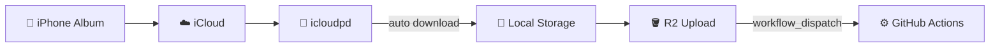

# icloud-to-r2

[한국어](README.ko.md)

A Docker-based tool that automatically syncs photos from an iPhone iCloud album to Cloudflare R2.



## Usage

### 1. Configure Environment Variables

```bash
cp .env.example .env
# Edit .env and fill in the values
```

### 2. iCloud Authentication (one-time setup)

```bash
docker compose run icloudpd icloudpd --username YOUR_APPLE_ID --cookie-directory /config
```

Enter the 2FA code to save the session cookie (~90 days validity).

### 3. Run

```bash
docker compose up -d
```

### How It Works

1. **icloudpd**: Periodically downloads photos from the configured iCloud album
   - Automatic HEIC → JPEG conversion
   - Skips video files
2. **sync-to-r2**: Uploads downloaded photos to R2
   - Auto-generates image metadata (width, height, blur hash)
   - Adds EXIF capture date and coarse location metadata when available
   - Skips already uploaded files
   - Triggers GitHub Actions workflow_dispatch on new uploads

## Environment Variables

| Variable | Required | Default | Description |
|----------|----------|---------|-------------|
| `APPLE_ID` | Yes | - | iCloud account email |
| `ALBUM_NAME` | Yes | - | iCloud album name to sync |
| `R2_BUCKET_NAME` | Yes | - | Cloudflare R2 bucket name |
| `R2_BUCKET_PREFIX` | Yes | - | Upload path prefix in R2 |
| `R2_ACCESS_KEY_ID` | Yes | - | R2 API access key |
| `R2_SECRET_ACCESS_KEY` | Yes | - | R2 API secret key |
| `R2_ACCOUNT_ID` | Yes | - | Cloudflare account ID |
| `GITHUB_TOKEN` | No | - | GitHub PAT (`actions:write` scope) |
| `GITHUB_REPO` | No | - | Target repository (e.g., `user/repo`) |
| `GITHUB_WORKFLOW` | No | `astro.yaml` | Workflow file to trigger |
| `SYNC_INTERVAL` | No | `7200` | R2 sync interval (seconds) |
| `ICLOUD_INTERVAL` | No | `3600` | iCloud sync interval (seconds) |
| `TZ` | No | `Asia/Seoul` | Timezone |
| `NOMINATIM_URL` | No | `https://nominatim.openstreetmap.org/reverse` | Reverse geocoding endpoint |
| `NOMINATIM_USER_AGENT` | No | `icloud-to-r2/1.0` | User-Agent for Nominatim requests |

## R2 Image Metadata

Each image's S3 object metadata stores the following values on upload:

```
width:  Image width (px)
height: Image height (px)
blur:   Base64-encoded blur hash (for placeholders)
taken-date:   Capture date from EXIF, date only (YYYY-MM-DD)
geo-country:  Coarse country name, when GPS exists
geo-region:   Coarse region/province name, when GPS exists
geo-city:     Coarse city name, when GPS exists
geo-district: Coarse district/borough name, when GPS exists
geo-label:    Display label, e.g. Korea, Seoul, Dongdaemun-gu
```

Correctly handles width/height for rotated images by accounting for EXIF orientation.
Raw GPS latitude, longitude, altitude, speed, direction, and capture time are not stored.
Existing object metadata is preserved when missing metadata is backfilled.

## iCloud Session Management

- Session cookies are stored in a Docker volume (`icloudpd-config`)
- Re-authentication is required after ~90 days when the session expires
- Monitor session status with `docker logs icloudpd`

## License

MIT
